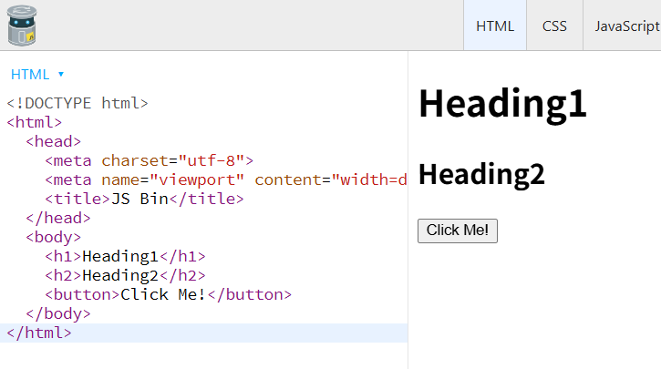
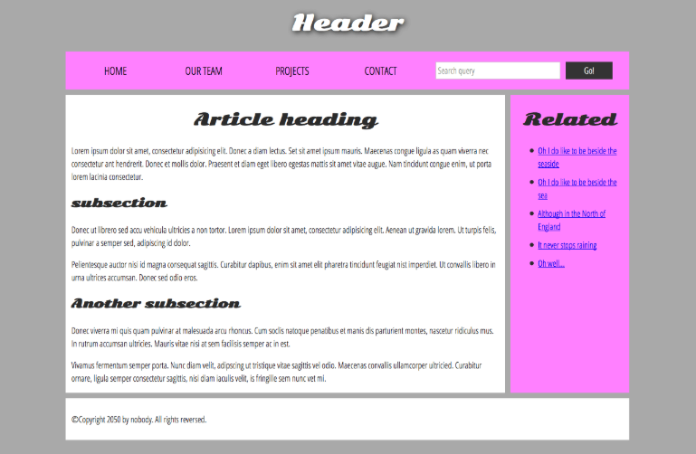
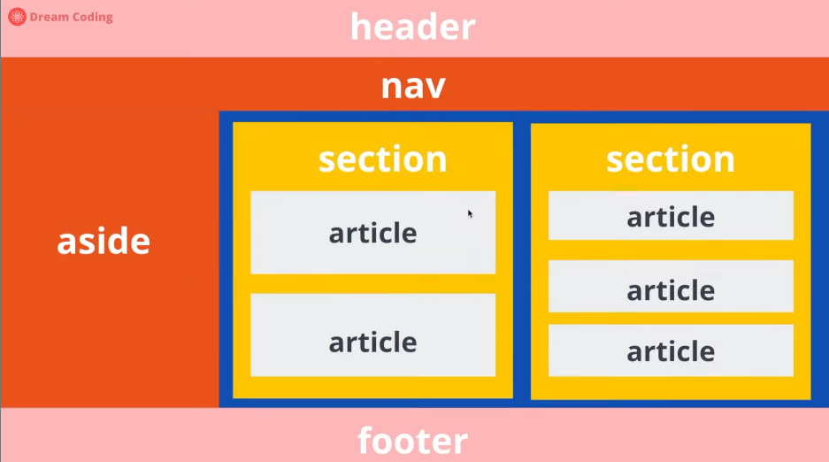
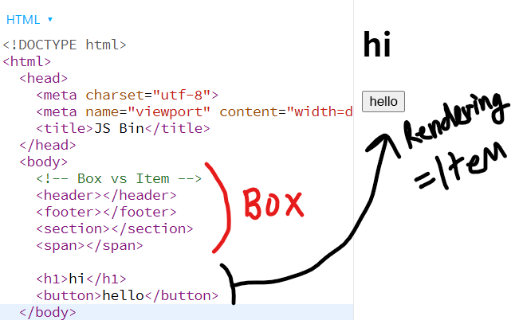
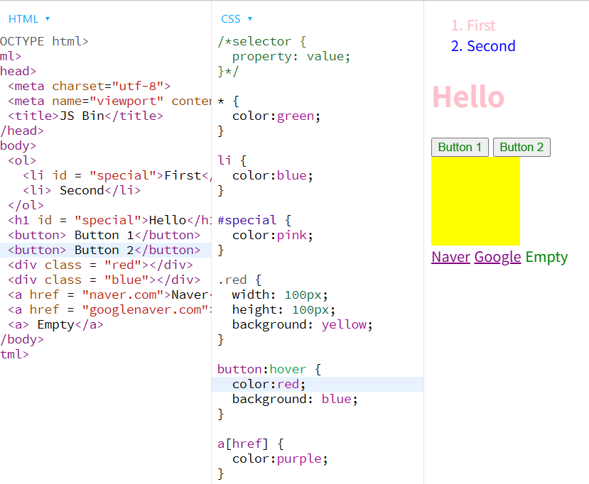
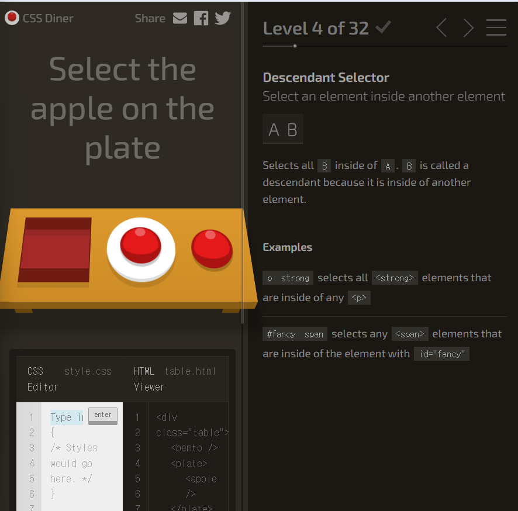
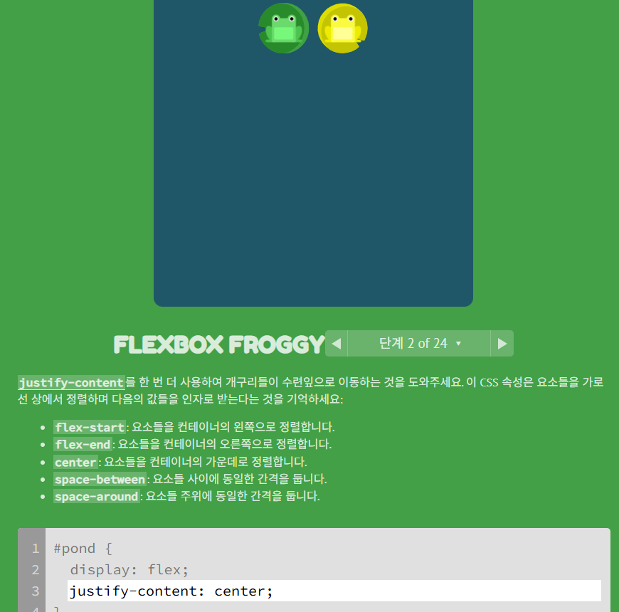

# 2025-07-18

## 입문

- vscode keyboard shortcuts: ctrl+shift+p
- 숏컷키에서 >live server 하면 바로바로 업데이트 되는 브라우저 창이 열림

## HTML

| Building block

| html head: meta data

| 브라우저 툴 보려면 ctrl+shift+i << 심심할 때 보면 재밋슬듯 :)

[jsbin.com](https://jsbin.com/?html,output)

[MDN]

태그 요소
(https://developer.mozilla.org/ko/docs/Web/HTML/Reference/Elements)

웹사이트 구조
(https://developer.mozilla.org/en-US/docs/Learn_web_development/Core/Structuring_content/Structuring_documents)

| TAGS

- BOX

header/ footer/ nav/ aside/ main/ section/ article/ div/ span/ form

- ITEM(사용자에게 보여지는)

a/ button/ input/ label/ img/ video/ audio/ map/ canvas/ table

<dl>
    <h2>ITEM - Block vs. Inline</h2>
    <dt>Block</dt>
    <dd>block level의 elements는 한 줄에 하나씩 배치</dd>
    <dd>div tag</dd>
    <dt>Inline</dt>
    <dd>Inline은 충분한 공간이 있으면 옆에 배치 가능</dd>
    <dd>내용이 있어야 브라우저에 드러남</dd>
    <dd>span tag</dd>
    <dd>기본 값을 display: block;로 바꾸면 block처럼 정렬됨</dd>
</dl>

## Tags 헷갈리는 거 정리

### article vs. section

- article: 독립적으로 고유한 정보 표기(e.g. 신문기사 중 기사 하나씩 보여줌)
- section: 관련 정보 그룹화 표기

### i tage vs. em tage

- em은 ㄹㅇ강조
- i는 그냥 이텔릭체 써줄 때

### b tag vs. strong tag

- strong은 ㄹㅇ강조
- b는 그냥 볼드체

### ol vs. ul vs. dl

- ol은 순서
- ul은 dot
- dl은 정의, 설명 목록

### button vs. a

- 리뷰 추천 로그인 가입 퀴즈 풀기 등등 사용자의 특정한 액션을 위한 <i>"버튼"</i>
- 링크 걸어 이동할 때 a 태그

## CSS

/_ selector {
property: value;
} _/ // 꾸미고 싶은 property, 그리고 value

<dl>
    <dt>Universal "*"</dt>
    <dd>모든 태그들 고르는 거</dd>
    <dt>type "Tag"</dt>
    <dd>태그 이름 고르기</dd>
    <dt>ID "#id"</dt>
    <dd>해쉬마크, 해당하는 id만 골라냄</dd>
    <dt>Class ".class"</dt>
    <dd>dot사용</dd>
    <dt>State :</dt>
    <dd>tag옆에 state를 달 수 있고</dd>
    <dt>Attribute []</dt>
    <dd>해당하는 속성 값들만 골라</dd>
</dl>

- [css 선택자](https://developer.mozilla.org/en-US/docs/Web/CSS/CSS_selectors)
- [css 레퍼런스](https://developer.mozilla.org/en-US/docs/Web/CSS/Reference)

* [css 문법을 연습해보아요 - https://flukeout.github.io/]

### Flexbox

div.container>div.item.item${$}\*10

| container

- display
- flex-direction
- flex-wrap
- flex-flow: 위 두 기능 한 번에 묶어 작성
- justify-content
- align-items
- align-content

이미지 이동 시키는 거 생각하면 됨. 중심axis, 서브 axis 구분 잘 하고

| item

- order
- flex-grow: container가 커질 떄 얼만큼 커질래
- flex-shrink: container가 작아질 때 얼만큼 작아질래
- flex: container 내에서 얼만큼 차지할래(%)
- align-self: 아이템 하나만.

[flexbox froggy](https://flexboxfroggy.com/#ko)

